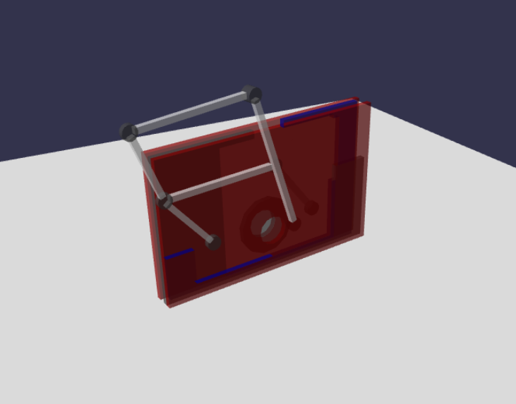

# Chebyshev Linkage Unit

Chebyshev link for Babylon.js.

## Usage

```js
import * as BABYLON from "babylonjs";

import { createChebyshevLinkageUnit } from "chebyshev-linkage-unit";

// ~ omission ~

const chebyshev = createChebyshevLinkageUnit(BABYLON, scene, {
  position: new BABYLON.Vector3(0, .5, 0),
});

engine.runRenderLoop(function () {
  chebyshev.drive(-50);

  scene.render();
});

```

